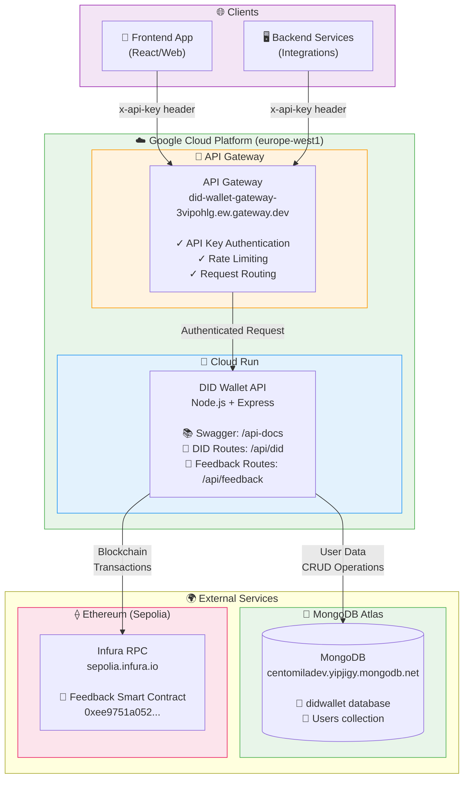

# DID Wallet API - Architecture

## Overview

The DID Wallet API is deployed on Google Cloud Platform (GCP) in the `europe-west1` region (Belgium), with API Gateway for authentication and Cloud Run for serverless container hosting.

## Architecture Diagram



## Components

### 1. API Gateway
- **URL:** `https://did-wallet-gateway-3vipohlg.ew.gateway.dev`
- **Purpose:** Authentication, rate limiting, and request routing
- **Authentication:** API Key via `x-api-key` header

### 2. Cloud Run Service
- **Service Name:** `did-wallet-api`
- **Region:** `europe-west1` (Belgium)
- **Runtime:** Node.js 20 (Alpine)
- **Endpoints:**
  - `/api-docs` - Swagger documentation
  - `/api/did/*` - DID management endpoints
  - `/api/feedback/*` - Feedback endpoints

### 3. MongoDB Atlas
- **Cluster:** `centomiladev.yipjigy.mongodb.net`
- **Database:** `didwallet`
- **Collections:**
  - `users` - User registrations with DID and profile data

### 4. Ethereum (Sepolia Testnet)
- **Provider:** Infura RPC
- **Smart Contract:** Feedback Contract at `0xee9751a0526442b9fD30aE998F9434Ac0fB6fC5d`

## Authentication

All API requests (except `/api-docs`) require the `x-api-key` header:

```bash
curl -H "x-api-key: YOUR_API_KEY" https://did-wallet-gateway-3vipohlg.ew.gateway.dev/api/did/users
```

## Environment Variables

| Variable | Description |
|----------|-------------|
| `MONGODB_URI` | MongoDB Atlas connection string |
| `INFURA_PROJECT_ID` | Infura project ID for Ethereum RPC |
| `PRIVATE_KEY` | Ethereum wallet private key for signing |
| `FEEDBACK_CONTRACT_ADDRESS` | Deployed feedback smart contract address |

## Data Flow

1. **Client Request** → Frontend/Backend sends request with API key
2. **API Gateway** → Validates API key, routes to Cloud Run
3. **Cloud Run** → Processes request, interacts with MongoDB/Ethereum
4. **Response** → Returns JSON response to client

